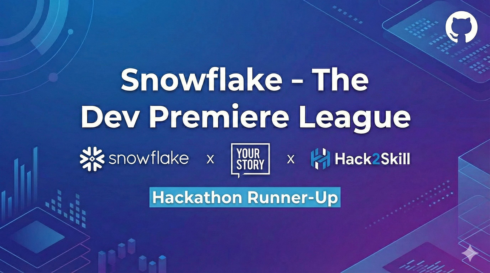
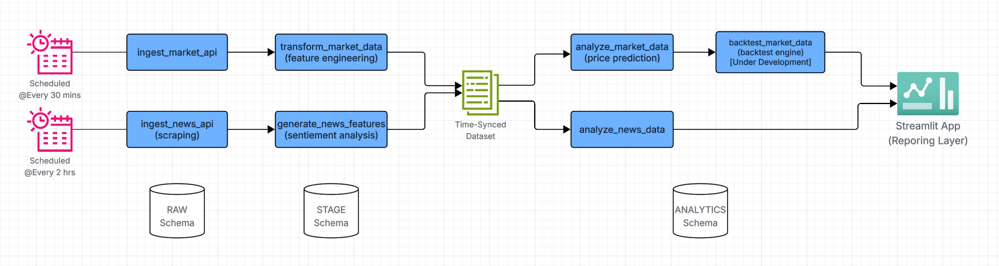
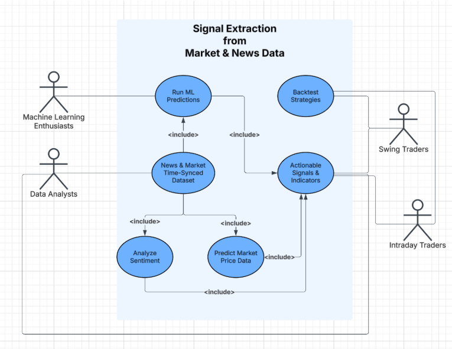
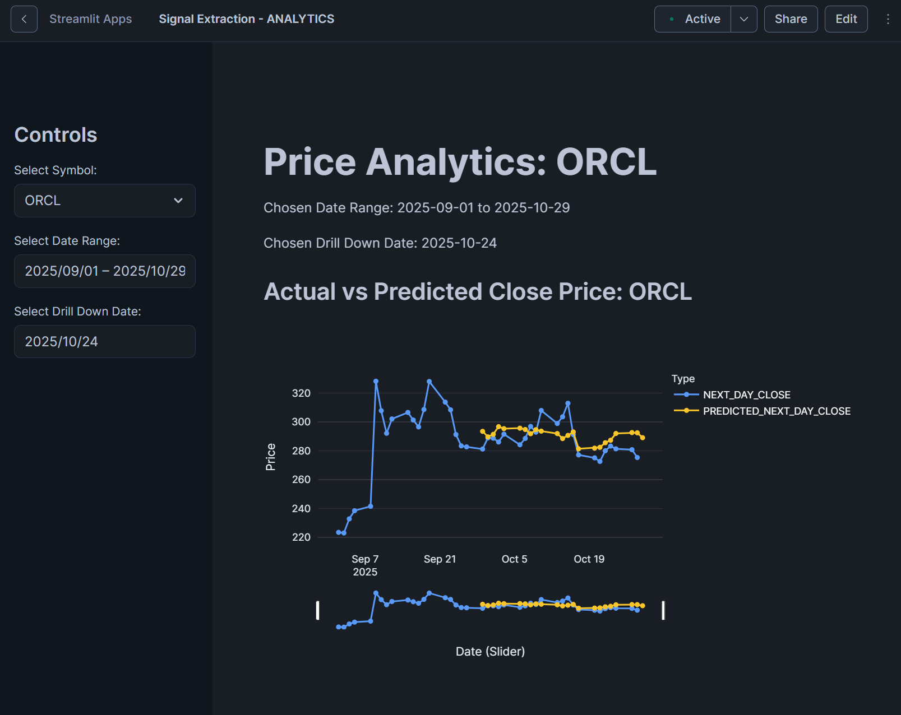
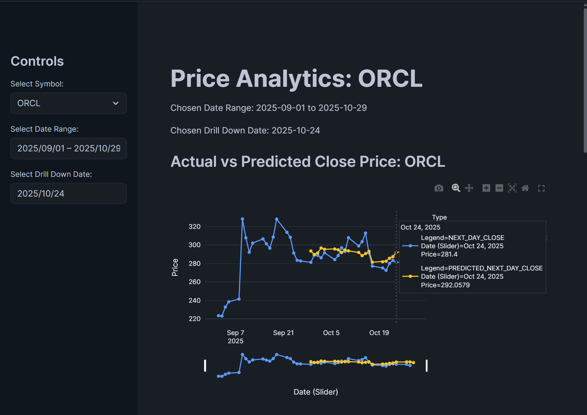
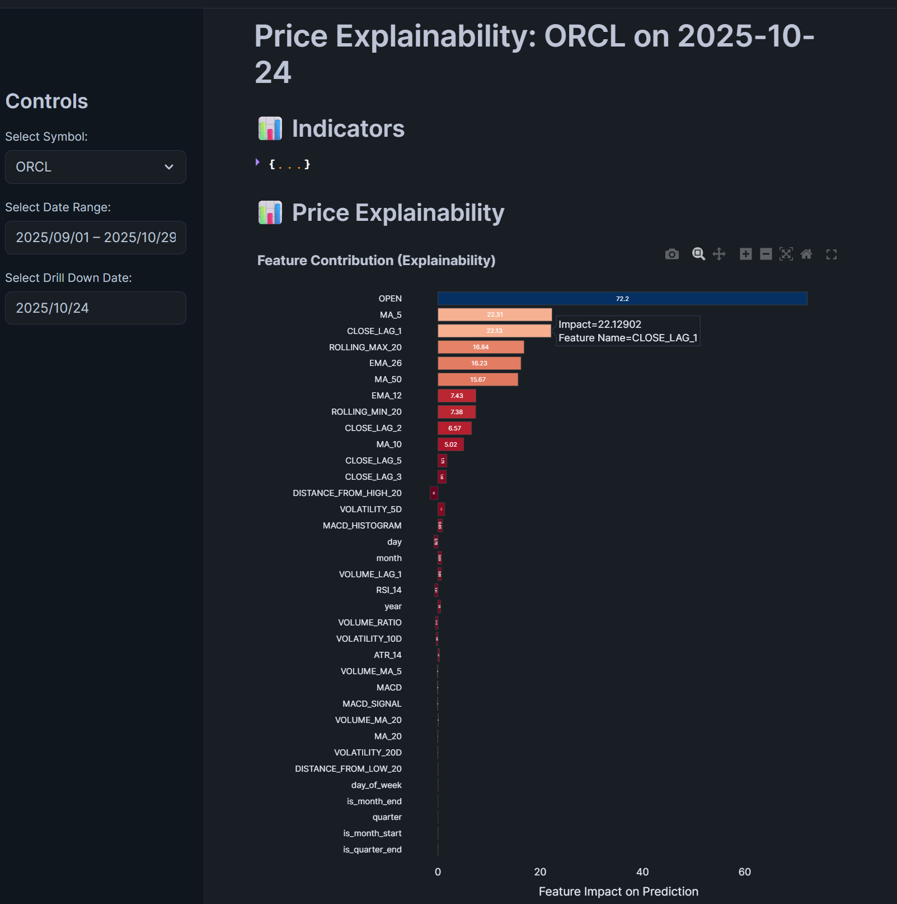
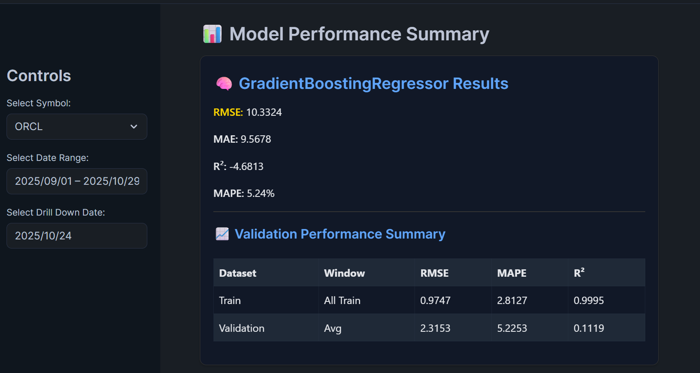
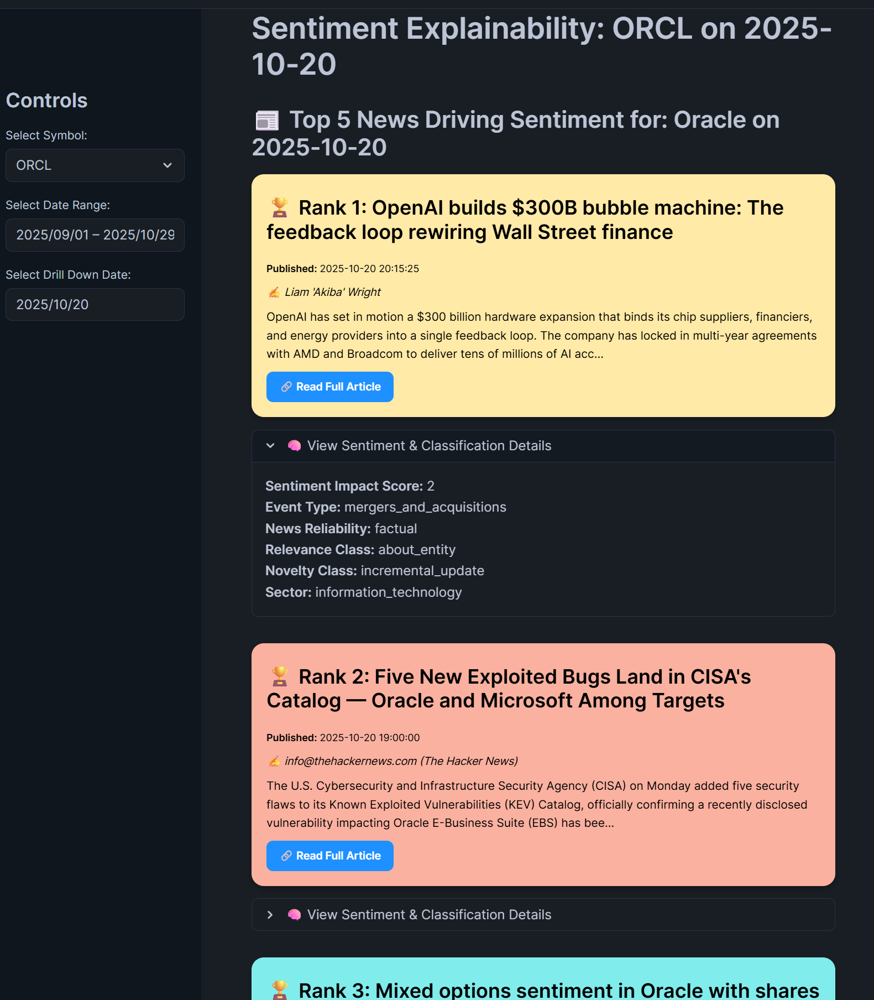
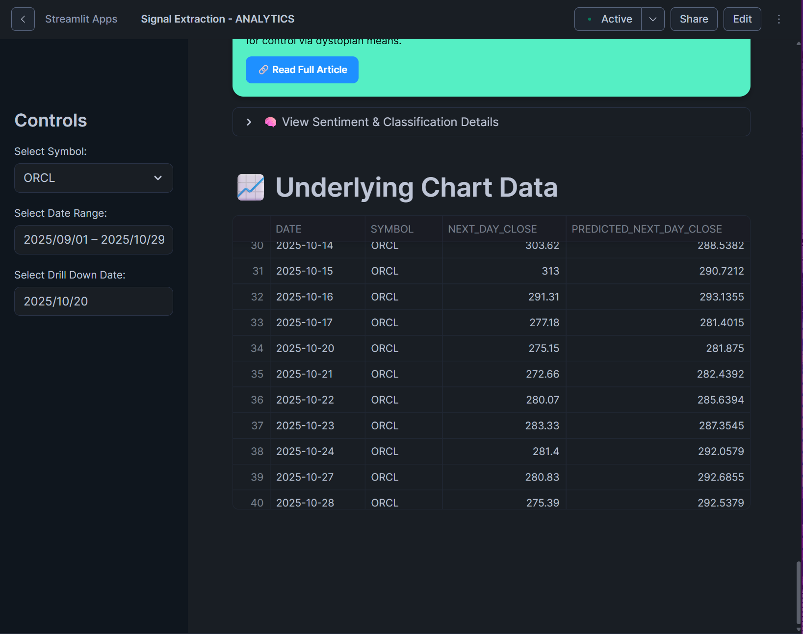
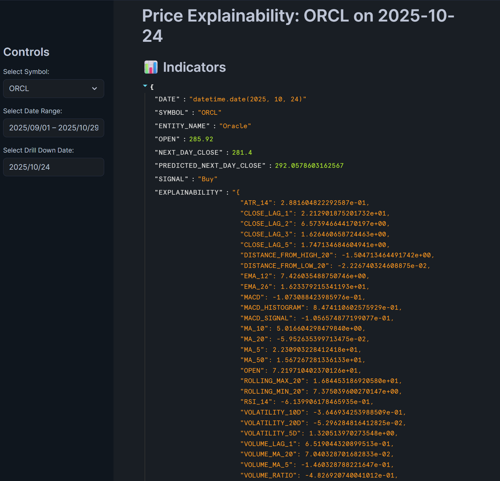

# 🚀 Signal Extraction ML Pipeline
*A Snowflake-powered end-to-end machine learning pipeline for financial signal generation and prediction.*

---


---

[](./docs/media/github_cover_image.png)

## 📖 Overview

**🏆 Hackathon Runner-Up** in **[Snowflake's Dev Premier League!](https://vision.hack2skill.com/event/gcc-dev-premier-league-2025)** 

This project was developed as part of the **Snowflake Hackathon**, securing a top runner-up position by building a complete **data ingestion → transformation → prediction → visualization** pipeline.  

It leverages **Snowflake’s Data Cloud**, **Snowpark**, and **Python ML libraries** to extract meaningful trading signals from financial and news data.

The goal: **generate predictive buy/sell signals** by combining **market price movements** and **news sentiment analysis** — all within a scalable Snowflake architecture.

---

## 🏆 Achievements

- **Runner-Up**: Secured Runner-Up place in Snowflake's Dev Premier League Hackathon for innovative ML pipeline design.
- **End-to-End Solution**: Fully automated pipeline from data ingestion to visualization, deployed on Snowflake.
- **Real-World Impact**: Demonstrated predictive trading signals with explainability and backtesting.

---

## ✨ Key Features

| Feature | Description |
|---------|-------------|
| 📊 **Data Ingestion** | Automated collection of stock prices via [Alpha Vantage API](https://www.alphavantage.co/) and financial news via [News API](https://newsapi.org/) |
| 🔧 **Feature Engineering** | Technical indicators (EMA, RSI, MACD, Volatility) + sentiment features (polarity, subjectivity, entity signals, recency) |
| 🔍 **Explainability** | SHAP-based model explanations & feature importance for predictions and sentiment analysis |
| 📈 **Backtesting** | (Under Development) Event-driven engine with PnL, Sharpe ratio, and drawdown analysis |
| ⚙️ **Orchestration** | Snowflake Tasks & Streams (Airflow-compatible) for end-to-end pipeline automation (ingestion → transform → training → scoring → backtests) |
| 🤖 **ML Pipeline** | XGBoost + Gradient Regressor with Snowpark; AI_CLASSIFY for sentiment labeling and an annotated dataset maintained for live news to improve and validate classifiers.|
| 📱 **Interactive Dashboard** | Streamlit app with signal explorer, explainability charts, and performance metrics |

---

## 🧰 Tech Stack

| Layer | Technology | Purpose |
|-------|-------------|----------|
| **Data Storage** | Snowflake (**SIGNAL_EXTRACTION_DB**) | Centralized data warehouse |
| **Compute** | Snowflake Warehouse (**COMPUTE_WH**) | Scalable compute for ETL + ML |
| **Ingestion** | Python, REST APIs | Pulls stock + news data |
| **Transformation** | Snowflake SQL, Snowpark | Data cleaning and feature creation |
| **ML** | Python (XGBoost, Pandas), Snowflake Libs | Model training & prediction |
| **Visualization** | Streamlit | Application & Reporting layer |

---

## 🧩 High Level Data Pipeline (Architecture)

[](./docs/diagrams/data_pipeline_flow_diagram.png)

## 🗂️ Use Case & Repository Structure

<details>
<summary>🧑‍💼 <b>Use Case Diagram</b> (click to expand)</summary>

[](./docs/diagrams/use_case_diagram.png)
</details>

---

<details>
<summary>🗂️ <b>Repository Structure</b> (click to expand)</summary>

```
📦 signal-extraction-ml-pipeline
├── 📁 src/
│   ├── 1_ingestion/
│   │   ├── 1_ingest_market_api.ipynb
│   │   ├── 1_ingest_news_api.ipynb
│   │   ├── market_config.json
│   │   └── news_config.json
│   ├── 2_transformation_and_feature_engineering/
│   │   └── 1_transformation_and_feature_engineering_market_data.sql
│   ├── 3_ml/
│   │   ├── 1_analyze_news_data.ipynb
│   │   ├── 1_predict_market_data.ipynb
│   │   ├── environment.yml
│   │   └── market_config.json
│   ├── 4_frontend/
│   │   ├── streamlit_app.py
│   │   ├── environment.yml
│   │   └── market_config.json
│   ├── 📁 infra/
│   ├── 📁 docs/
│   ├── 📁 env/  # Virtual environment (auto-generated)
│   └── 📁 utils/
├── [requirements.txt]
├── [README.md]
└── LICENSE
```
</details>

---

## 📈 Visualization & Outputs 
<details>
<summary>📈 <b>Visualizations</b> (click to expand)</summary>

### 📈 Price Prediction Graph
[](./docs/demo_screenshots/1_main_graph.png)
[](./docs/demo_screenshots/1_main_graph_with_hover.png)

### 🔍 Price Explainability
[](./docs/demo_screenshots/3_price_explainability.png)

### 📊 Model Performance Summary
[](./docs/demo_screenshots/4_model_performance_summary.png)

### 📰 News Sentiment Ranked
[](./docs/demo_screenshots/5_news_sentiment_ranked.png)

</details>

---

<details>
<summary>📊 <b>Underlying Data Outputs</b> (click to expand)</summary>

### 📋 Underlying Chart Data
[](./docs/demo_screenshots/6_underlying_chart_data.png)

### 📦 Indicators JSON Dump
[](./docs/demo_screenshots/2_indicators_json_dump.png)

</details>

---
## ⚙️ Setup & Installation

<details>
<summary>⚙️ <b>Steps</b> (click to expand)</summary>

### 1️⃣ **Prerequisites**
- Python 3.9+
- Snowflake account with appropriate roles
- Alpha Vantage & News API keys
- Snowflake Python Connector installed

### 2️⃣ **Clone the Repository**
```bash
git clone https://github.com/<your-username>/signal-extraction-ml-pipeline.git
cd signal-extraction-ml-pipeline
```

### 3️⃣ **Install Dependencies**
```bash
pip install -r requirements.txt
```

### 4️⃣ **Configure Environment**
Edit `market_config.json` & `news_config.json`:
```json
{
  "...": "...",
  "snowflake": {
    "account": "XXXXXX",
    "user": "YOUR_USERNAME",
    "password": "YOUR_PASSWORD",
    "role": "ACCOUNTADMIN",
    "warehouse": "COMPUTE_WH",
    "database": "SIGNAL_EXTRACTION_DB",
    "schema": "<CODE>"
  }
}
```

### 5️⃣ **Run Pipeline**
```bash
# Infra Setup
execute infra/{code}
# Ingestion Execution
python src/1_ingestion/1_ingest_market_api.ipynb
python src/1_ingestion/1_ingest_news_api.py
# Transformation & Feature Generation Execution
execute 2_transformation_and_feature_engineering/1_transform_and_feature_engineering_market_data.sql
python 2_transformation_and_feature_engineering/1_generate_news_articles_features.ipynb
# ML Execution
python src/3_ml/1_analyze_news_data.sql
python src/3_ml/1_predict_market_data.ipynb
python src/3_ml/2_backtest_market_data.ipynb
# Visualization Application Setup
python src/4_frontend/streamlit_app.py
```

</details>

---

## 🎬 Submission & Showcase Resources

- Streamlit Dashboard/Application (30 Oct 2025): [View Live Application here](https://app.snowflake.com/us-east-1/lac70367/#/streamlit-apps/SIGNAL_EXTRACTION_DB.UTILS.AINREU5NXYDJBG2Y)
- Pitch deck / PPT (30 Oct 2025): [View PPT](https://docs.google.com/document/d/1c9Qy6GgJpTSRA4xQ8zxRiReXrwkVUUJwiLLs-sSE3p8/edit?usp=drive_link)  
- Demo video submission record (5 Oct 2025): [Watch here](https://docs.google.com/spreadsheets/d/13Ox-XF97oV5iL6ayVca-iZSWQKuh_CHZ2eAQudx7dWA/edit?usp=drive_link)  
- Idea Submission PPT (5 Oct 2025): [View PPT](https://docs.google.com/presentation/d/1A272S39itsuTwZJN7cSLmhS9Qb8TdQCz/edit?usp=drive_link&ouid=111214650582844966665&rtpof=true&sd=true)  

## 🧑‍💻 Author

**Aravind Suresh**  
Data Engineer @ GE Aerospace | ML & Cloud Enthusiast  
[](https://www.linkedin.com/in/aravind-suresh8) [](https://github.com/aravxdev)

**Abirami Sadasivam**  
SDE @ VISA | ML & Cloud Enthusiast  
[](https://linkedin.com/in/abirami-sadasivam) [](https://github.com/abixdev)

**Sidhanth LS**  
Data Scientist @ Freshworks  
[](https://linkedin.com/in/sidhantls) [](https://github.com/sidhantls)


> 🤝 Connect with the team on LinkedIn for collaborations!

---

## 🪶 License

This project is licensed under the [MIT License](LICENSE).

---

## 🏁 Acknowledgments

Special thanks to:
- **Snowflake** for its developer ecosystem  
- **Alpha Vantage** and **News API** for financial data sources  
- **Hackathon Mentors** and collaborators for their support ([Snowflake - The Dev Premiere League](https://vision.hack2skill.com/event/gcc-dev-premier-league-2025))

---

⭐ *If you like this project, give it a star on GitHub — your support keeps it growing!*
