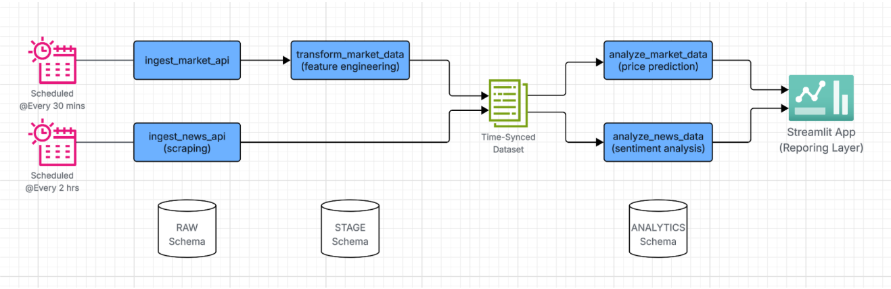

# 🚀 Signal Extraction ML Pipeline  
*A Snowflake-powered end-to-end machine learning pipeline for financial signal generation and prediction.*

---


---

## 📖 Overview

This project was developed as part of the **Snowflake Hackathon**, focusing on building a complete **data ingestion → transformation → prediction → visualization** pipeline.  
It leverages **Snowflake’s Data Cloud**, **Snowpark**, and **Python ML libraries** to extract meaningful trading signals from financial and news data.

The goal: **generate predictive buy/sell signals** by combining **market price movements** and **news sentiment analysis** — all within a scalable Snowflake architecture.

---

## 🧠 Features

✅ **Automated Data Ingestion**
- Fetches stock price data via [Alpha Vantage API](https://www.alphavantage.co/)  
- Collects related financial news via [News API](https://newsapi.org/)

✅ **Medallion Architecture (RAW → CURATED → ML)**
- Structured Snowflake layers for data governance and efficiency

✅ **Transformation with SQL + Snowpark**
- Includes normalization, feature engineering, and EMA computations

✅ **Machine Learning Pipeline**
- XGBoost-based model trained on curated Snowflake data  
- Predicts directional signals and confidence scores

✅ **Fully Automated Orchestration**
- Ready for **Airflow** or **Snowflake Tasks / Streams** integration

✅ **Visualization Layer**
- Interactive dashboards built for **Spotfire / Streamlit**

---

## 🧰 Tech Stack

| Layer | Technology | Purpose |
|-------|-------------|----------|
| **Data Storage** | Snowflake (**SIGNAL_EXTRACTION_DB**) | Centralized data warehouse |
| **Compute** | Snowflake Warehouse (**COMPUTE_WH**) | Scalable compute for ETL + ML |
| **Ingestion** | Python, REST APIs | Pulls stock + news data |
| **Transformation** | Snowflake SQL, Snowpark | Data cleaning and feature creation |
| **ML** | Python (XGBoost, Pandas) | Model training & prediction |
| **Visualization** | Streamlit | Application & Reporing layer |

---
## 🎬 Demo & Presentation

- Demo video: [Watch here](https://drive.google.com/file/d/1iWiBB3lU3H3SMDZ82SmHFFqlPTmzbApU/view?usp=drive_link) on Google Drive.
- Presentation (PPT/PDF): [Check it out here](https://docs.google.com/presentation/d/1A272S39itsuTwZJN7cSLmhS9Qb8TdQCz/edit?usp=drive_link&ouid=111214650582844966665&rtpof=true&sd=true)


## 🧩 Architecture

```
         ┌────────────────────┐
         │   API Ingestion    │
         │ (Alpha Vantage,    │
         │   News API)        │
         └────────┬───────────┘
                  │
         ┌────────▼──────────┐
         │ Snowflake Staging │
         │  (RAW Layer)      │
         └────────┬──────────┘
                  │
         ┌────────▼──────────┐
         │ Data Transformation│
         │  (STAGING Layer)   │
         └────────┬──────────┘
                  │
         ┌────────▼──────────┐
         │ ML Pipeline (Python│
         │ + Snowpark UDFs)   │
         └────────┬──────────┘
                  │
         ┌────────▼──────────┐
         │ Visualization     │
         │  (Streamlit)      │
         └───────────────────┘
```

[](./docs/media/Architecture-1.png)
---

<details>
<summary>🧑‍💼 <b>Use Case Diagram</b> (click to expand)</summary>

[](./docs/media/UseCase-1.png)
</details>

---

<details>
<summary>🗂️ <b>Repository Structure</b> (click to expand)</summary>

```
📦 signal-extraction-ml-pipeline
├── 📁 src/
│   ├── 1_ingestion/
│   │   ├── 1_ingest_market_api.ipynb
│   │   ├── 1_ingest_news_api.ipynb
│   │   ├── market_config.json
│   │   └── news_config.json
│   ├── 2_transformation_and_feature_engineering/
│   │   └── 1_transformation_and_feature_engineering_market_data.sql
│   ├── 3_ml/
│   │   ├── 1_analyze_news_data.ipynb
│   │   ├── 1_predict_market_data.ipynb
│   │   ├── environment.yml
│   │   └── market_config.json
│   ├── 4_frontend/
│   │   ├── streamlit_app.py
│   │   ├── environment.yml
│   │   └── market_config.json
│   └── infra/
├── 📁 docs/
├── requirements.txt
├── README.md
└── LICENSE
```
</details>

---

## ⚙️ Setup & Installation

### 1️⃣ **Prerequisites**
- Python 3.9+
- Snowflake account with appropriate roles
- Alpha Vantage & News API keys
- Snowflake Python Connector installed

### 2️⃣ **Clone the Repository**
```bash
git clone https://github.com/<your-username>/signal-extraction-ml-pipeline.git
cd signal-extraction-ml-pipeline
```

### 3️⃣ **Install Dependencies**
```bash
pip install -r requirements.txt
```

### 4️⃣ **Configure Environment**
Edit `configs/snowflake_config.json`:
```json
{
  "account": "XXXXXX",
  "user": "YOUR_USERNAME",
  "password": "YOUR_PASSWORD",
  "role": "ACCOUNTADMIN",
  "warehouse": "COMPUTE_WH",
  "database": "SIGNAL_EXTRACTION_DB",
  "schema": "RAW"
}
```

### 5️⃣ **Run Pipeline**
```bash
execute infra/{code}
python src/1_ingestion/1_ingest_market_api.ipynb
python src/1_ingestion/1_ingest_news_api.py
execute src/2_transformation_and_feature_engineering/1_transformation_and_feature_engineering_market_data.sql
python src/3_ml/1_analyze_news_data.ipynb
python src/3_ml/1_predict_market_data.ipynb
python src/4_frontend/streamlit_app.py
```

---

## 📊 Example Outputs

| Symbol | Date | Predicted Signal | Confidence |
|--------|------|------------------|-------------|
| AAPL | 2025-10-01 | **Buy** | 0.87 |
| ORCL | 2025-10-01 | **Sell** | 0.78 |
| TSLA | 2025-10-01 | **Hold** | 0.65 |

---

## 🔮 Future Enhancements

- [ ] Automate runs using **Snowflake Tasks**  
- [ ] Add **sentiment classification** via NLP  
- [ ] Deploy model versioning with **MLflow**  
- [ ] Real-time signal updates using **Snowpipe + EventBridge**

---

## 🧑‍💻 Author

**Aravind Suresh**  
Data Engineer @ GE Aerospace | ML & Cloud Enthusiast  
📍 [LinkedIn](https://www.linkedin.com/in/aravind-suresh8) • [GitHub](https://github.com/aravxdev)

**Abirami Sadasivam**  
SDE @ VISA | ML & Cloud Enthusiast  
📍 [LinkedIn](https://linkedin.com/in/abirami-sadasivam) • [GitHub](https://github.com/abixdev)

**Sidhanth LS**  
Data Scientist @ Freshworks  
📍 [LinkedIn](https://linkedin.com/in/sidhantls) • [GitHub](https://github.com/xxx)

---

## 🪶 License

This project is licensed under the [MIT License](LICENSE).

---

## 🏁 Acknowledgments

Special thanks to:
- **Snowflake** for its developer ecosystem  
- **Alpha Vantage** and **News API** for financial data sources  
- **Hackathon Mentors** and collaborators for their support ([Snowflake - The Dev Premiere League](https://vision.hack2skill.com/event/gcc-dev-premier-league-2025))

---

⭐ *If you like this project, give it a star on GitHub — your support keeps it growing!*
